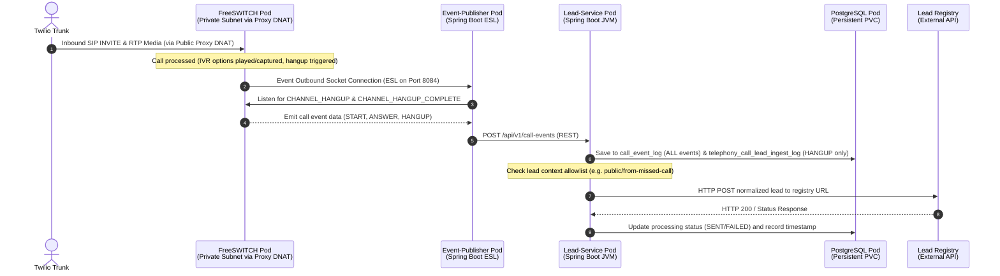

# FreeSWITCH Telephony System - Production Deployments

This repository contains the application source code, Dockerfiles, Helm charts, and CI/CD configurations for the FreeSWITCH telephony lead generation platform. The codebase supports multiple operational flows and deployment architectures across distinct Git branches.

---

## 1. Branch Strategy and Directory Layout

To support different deployment environments and call flows, this repository is organized into three main branches:

| Branch | Infrastructure / Deployment | Call Flow Style | Key Features & Directories |
|:---|:---|:---|:---|
| **`freeswitch`** | Standalone AWS EC2 Instances | Missed-Call Ingest | Built using Docker Compose. Deploy files in `deploy/` include standalone EC2 configs, Dockerfiles, and compose files. **No Kubernetes dependencies**. |
| **`freeswitch-kubernetes`** | Kubernetes Cluster (Kubespray) | Missed-Call Ingest | Built using Helm. Deploy files in `deploy/` contain K8s manifests, Helm charts, and ECR auth settings. Sourced with `greeting.wav` only. |
| **`freeswitch-ivr-kubernetes`** | Kubernetes Cluster (Kubespray) | Multilingual IVR | Built using Helm. Sourced with the complete set of IVR prompt files under `deploy/freeswitch/audio/`. |

### Directory Structure (Kubernetes Branches)

```
.
├── Jenkinsfile                 # Jenkins CI/CD declarative pipeline
├── deploy/                     # Kubernetes deployment configurations (formerly infra/)
│   ├── freeswitch/             # Raw FreeSWITCH Dockerfile, configmaps, and deployments
│   ├── helm/                   # Helm packaging for the application stack
│   │   └── telephony/          # Telephony Helm chart (Chart.yaml, values.yaml)
│   └── postgres/               # Postgres database and pgAdmin deployment
├── service/                    # Backend Spring Boot services source code
│   ├── event-publisher/        # Spring Boot ESL event publisher (REST-based)
│   └── lead-service/           # Spring Boot lead ingestion & call event logging service
├── test/                       # Integration testing scripts
│   └── integration/            # Test call and DB validation utilities
├── .gitignore                  # Git ignore rules for Java/Kubernetes
└── README.md                   # This architecture guide
```

---

## 2. Runtime Flow and Architecture

The sequence below details the call routing, event propagation, and ingestion pipeline inside the Kubernetes cluster:



1. **FreeSWITCH Pod**: Listens on the host network for forwarded SIP/RTP traffic from the public proxy, plays the welcome greeting/IVR menus, and connects the ESL socket to Event-Publisher.
2. **Event-Publisher**: Connects to the FreeSWITCH outbound socket, receives call events, and forwards them to Lead-Service via REST API (`POST /api/v1/call-events`). Includes retry logic for resilience.
3. **Lead-Service**: Receives call events via REST, logs ALL events to the `call_event_log` table for audit trail, and creates leads from HANGUP events by saving to `telephony_call_lead_ingest_log` and posting to the external registry.


## 3. Packaging and Deploying via Helm

We package the entire telephony stack into a single Helm chart located at `deploy/helm/telephony`.

### Deploying the Helm Chart
To deploy the chart using your custom values:
```bash
helm upgrade --install telephony ./deploy/helm/telephony \
  --set global.registry="379220350808.dkr.ecr.ap-northeast-1.amazonaws.com" \
  --set leadService.image.tag="latest" \
  --set eventPublisher.image.tag="latest" \
  --set freeswitch.image.tag="latest"
```

---

## 5. On-Premise Migration Roadmap

To transition this telephony stack from AWS (EC2/EKS) to an on-premise hardware setup running Ubuntu 22.04 or 24.04:

### 1. Cluster Bootstrapping (Kubespray)
We will use **Kubespray** to deploy a standard, upstream Kubernetes cluster on physical nodes. Kubespray uses Ansible to automate:
* Operating system package updates.
* Container runtime installation (containerd).
* Kubernetes system binaries setup (`kubelet`, `kubeadm`, `kubectl`).
* Multi-node network configuration using the **Calico** CNI plugin.

### 2. Load Balancing (MetalLB)
Since on-premise environments do not have cloud load balancers, we configure **MetalLB** in Layer 2 mode inside the cluster.
* Edit `values.yaml` to set `global.onPremise = true` and define your local subnet IP range in `metallb.ipRange`.
* MetalLB will assign static physical IPs to your Kubernetes services from the pool to route external traffic into the cluster.