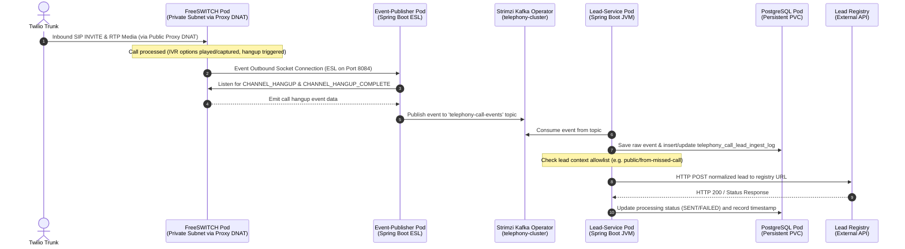

# FreeSWITCH Telephony System - Kubernetes Production Deployment

This branch contains the Kubernetes manifests, Helm packaging, and CI/CD configurations for running the FreeSWITCH telephony system on a production Kubernetes cluster. It is designed to scale horizontally and deploy all stateful and stateless components inside Kubernetes pods.

---

## 1. Runtime Flow and Architecture

The sequence below details the call routing, event propagation, and ingestion pipeline inside the Kubernetes cluster:



1. **FreeSWITCH Pod**: Listens on the host network for forwarded SIP/RTP traffic from the public proxy, plays the welcome greeting/IVR menus, and connects the ESL socket to Event-Publisher.
2. **Event-Publisher**: Connects to the FreeSWITCH outbound socket, receives events, and publishes them to the Kafka broker.
3. **Lead-Service**: Consumes call hangup events from Kafka, logs them to PostgreSQL, and posts the lead payload to the external lead registry.


---

## 2. Directory Structure

```
.
├── Jenkinsfile                 # Jenkins CI/CD pipeline
├── infra/                      # Kubernetes deployment configurations
│   ├── freeswitch/             # Raw FreeSWITCH configmaps and deployments
│   ├── helm/                   # Helm packaging for the application stack
│   │   └── telephony/          # Telephony Helm chart (Chart.yaml, values.yaml)
│   ├── kafka/                  # Kafka cluster & topic definitions
│   └── postgres/               # Postgres database and pgAdmin deployment
├── service/                    # Backend services source code
│   ├── event-publisher/        # Spring Boot ESL event-to-Kafka publisher
│   └── lead-service/           # Spring Boot Kafka-to-Registry lead ingestion service
├── test/                       # Integration testing scripts
│   └── integration/            # Test call and DB validation utilities
├── .gitignore                  # Git ignore rules for Java/Kubernetes
└── README.md                   # This architecture guide
```

---

## 3. CI/CD Deployment with Jenkins

We use a declarative Jenkins pipeline (`Jenkinsfile`) for automated testing and deployment.

### Jenkins Pipeline Stages
1. **Checkout**: Checks out the branch code from Git.
2. **Build Java Artifacts**: Packages the Spring Boot applications using Maven.
3. **Docker Build & Tag**: Builds the Docker images for `lead-service`, `event-publisher`, and `freeswitch`.
4. **ECR Push**: Pushes the Docker images to your AWS ECR Registry.
5. **Deploy to Kubernetes**: Runs `helm upgrade --install` to deploy the Helm chart to the cluster using the current build number tags.

---

## 4. Packaging and Deploying via Helm

We package the entire telephony stack into a single Helm chart located at `infra/helm/telephony`.

### Deploying the Helm Chart
To deploy the chart using your custom values:
```bash
helm upgrade --install telephony ./infra/helm/telephony \
  --set global.registry="379220350808.dkr.ecr.ap-northeast-1.amazonaws.com" \
  --set leadService.image.tag="latest" \
  --set eventPublisher.image.tag="latest" \
  --set freeswitch.image.tag="latest"
```

---

## 5. On-Premise Migration Roadmap

To transition this telephony stack from AWS (EC2/EKS) to an on-premise hardware setup running Ubuntu 22.04 or 24.04:

### 1. Cluster Bootstrapping (Kubespray)
We will use **Kubespray** to deploy a standard, upstream Kubernetes cluster on physical nodes. Kubespray uses Ansible to automate:
* Operating system package updates.
* Container runtime installation (containerd).
* Kubernetes system binaries setup (`kubelet`, `kubeadm`, `kubectl`).
* Multi-node network configuration using the **Calico** CNI plugin.

### 2. Load Balancing (MetalLB)
Since on-premise environments do not have cloud load balancers, we configure **MetalLB** in Layer 2 mode inside the cluster.
* Edit `values.yaml` to set `global.onPremise = true` and define your local subnet IP range in `metallb.ipRange`.
* MetalLB will assign static physical IPs to your Kubernetes services from the pool to route external traffic into the cluster.