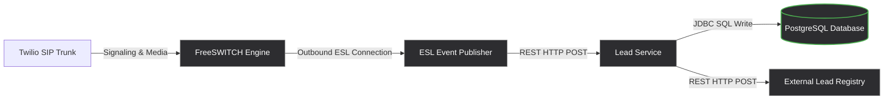

# FreeSWITCH Telephony Service

This repository contains the deployment blueprints, configurations, and application source code for the FreeSWITCH-based lead ingestion platform. The codebase supports standalone virtual machine orchestrations as well as cloud-native Kubernetes deployments.

To maintain modularity and isolation across different environments, all source code and deployment manifests reside in dedicated branches. The main branch serves strictly as a landing page and branch navigation index.

---

## Repository Branch Mapping

| Branch | Target Environment | Deployment Orchestration | Call Ingestion Type | Key Features |
| :--- | :--- | :--- | :--- | :--- |
| **[freeswitch](https://github.com/A5HW1NRA7AN/Telephony-Service/tree/freeswitch)** | Standalone AWS EC2 VM | Docker Compose | Missed-Call | Outbound ESL publisher routing call events directly to the Lead Service via REST API. |
| **[freeswitch-kubernetes](https://github.com/A5HW1NRA7AN/Telephony-Service/tree/freeswitch-kubernetes)** | Kubernetes Cluster (EKS/Kubespray) | Helm Chart | Missed-Call | Clustered FreeSWITCH StatefluSet deployments utilizing hostNetwork port mapping. |
| **[freeswitch-ivr-kubernetes](https://github.com/A5HW1NRA7AN/Telephony-Service/tree/freeswitch-ivr-kubernetes)** | Kubernetes Cluster (EKS/Kubespray) | Helm Chart | Multilingual IVR | Extends the K8s missed-call stack to support interactive voice menus and DTMF capturing. |

---

## Technical Architecture

The following diagram illustrates the horizontal propagation of call signaling, event streams, and database transactions:



---

## Getting Started

To explore, run, or deploy the telephony stacks, check out the specific branch matching your target environment:

### 1. Standalone EC2 Deployment
This setup is designed for running on a single virtual machine using Docker Compose.
```bash
git checkout freeswitch
```
Refer to the [freeswitch README](https://github.com/A5HW1NRA7AN/Telephony-Service/blob/freeswitch/README.md) for instructions on Terraform environment provisioning, dialplan configurations, and Docker Compose initialization.

---

### 2. Kubernetes missed-call Deployment
This setup is designed for scaling containerized deployments using Helm.
```bash
git checkout freeswitch-kubernetes
```
Refer to the [freeswitch-kubernetes README](https://github.com/A5HW1NRA7AN/Telephony-Service/blob/freeswitch-kubernetes/README.md) for EKS / Kubespray deployment guides, values.yaml configurations, and container build steps.

---

### 3. Kubernetes Multilingual IVR Deployment
This setup adds an interactive voice menu flow to the Kubernetes deployment.
```bash
git checkout freeswitch-ivr-kubernetes
```
Refer to the [freeswitch-ivr-kubernetes README](https://github.com/A5HW1NRA7AN/Telephony-Service/blob/freeswitch-ivr-kubernetes/README.md) for dialplan XML mapping, custom greeting wave files, and IVR menu configurations.

---
