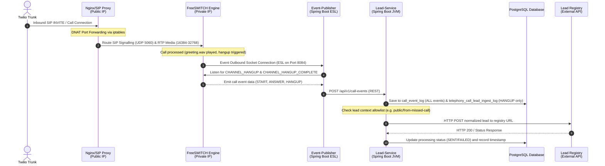

# FreeSWITCH Telephony System - Standalone EC2 Deployment

This branch contains the deployment configuration and source code for running the FreeSWITCH telephony system on a secure, standalone AWS EC2 stack. It utilizes a split-network topology with a public-facing Bastion host, a public-facing Nginx/SIP Proxy host, and a private FreeSWITCH application stack host running inside a custom VPC.

---

## 1. Runtime Flow and Architecture

The sequence below details the flow of an inbound call, how events are parsed, and how leads are normalized and dispatched:



1. **Bastion Jump Host** (Public Subnet): Strictly handles secure SSH administration.
2. **Nginx / SIP Proxy** (Public Subnet): Exposes HTTP default routes for reverse-proxying web consoles, and implements iptables DNAT rules to route SIP (5060) and RTP (16384-32768) traffic into the private subnet.
3. **FreeSWITCH Host** (Private Subnet): Runs the core FreeSWITCH instance alongside PostgreSQL, pgAdmin, Event-Publisher, and Lead-Service in a host-network-bridged Docker Compose stack.

---

## 2. Directory Structure

```
.
├── .github/                    # GitHub CI/CD Workflows
│   └── workflows/
│       └── deploy.yml          # Tag-based ECR build and remote deploy workflow
├── config/                     # FreeSWITCH config files
│   └── freeswitch.xml          # Core dialplan, modules, and Sofia settings
├── infra/                      # Terraform & Deployment configurations
│   ├── run_call.sh             # Triggers a local loopback call for testing
│   ├── run_db_query.sh         # Queries the remote database
│   ├── instances.tf            # Provisions EC2 instances and Nginx/NAT userdata
│   ├── main.tf                 # VPC definition and provider settings
│   ├── outputs.tf              # Outputs IPs and SSH commands
│   ├── security.tf             # Generates key pair and declares Security Groups
│   └── variables.tf            # Configurable Terraform inputs
├── service/                    # Backend services source code
│   ├── event-publisher/        # Spring Boot ESL event publisher (REST-based)
│   └── lead-service/           # Spring Boot lead ingestion & call event logging service
├── docker-compose.yml          # Runs backend services on the private host
├── .env.example                # Example environment file template
├── .gitignore                  # Git ignore rules for Java/Terraform
└── README.md                   # This architecture guide
```

---

## 3. Deployment Steps

### Step 1: Provision AWS Infrastructure via Terraform
1. Navigate to the Terraform directory:
   ```bash
   cd infra
   ```
2. Initialize and apply the configurations:
   ```bash
   terraform init
   ```
3. Apply configurations to provision resources:
   ```bash
   terraform apply -auto-approve
   ```
4. Record the outputs:
   - `proxy_public_ip` (Proxy Gateway Elastic IP)
   - `bastion_public_ip` (SSH Jump Host)
   - `freeswitch_private_ip` (Private Server IP)
   - `freeswitch-key.pem` (Automatically generated private key)

### Step 2: Configure Twilio Elastic SIP Trunking
1. Set up a Twilio Elastic SIP Trunk pointing to your `proxy_public_ip` as the Origination URI:
   `sip:<proxy_public_ip>:5060`
2. Bind a public phone number to the trunk (e.g. `+13613101995`).
3. Set Termination SIP URI to `coss-freeswitch.pstn.twilio.com` whitelisting the `proxy_public_ip`.

### Step 3: CI/CD Deployment via GitHub Actions
We use automated tag-based GitHub Actions to build, package, and deploy backend updates. See the detailed `setup_guide.md` at the root of the repository to configure repository secrets and push tags.

Once ECR build and deployment are completed, the Docker containers on the private instance will automatically be updated with the latest service code.

---

## 4. Verification & Testing

1. Check that all 5 containers are healthy on the private host:
   ```bash
   docker ps --format "table {{.Names}}\t{{.Status}}"
   ```
2. Watch the FreeSWITCH CLI:
   ```bash
   docker exec -it telephony-freeswitch fs_cli -p CluSt3r@Esl#2026!
   ```
3. Make an inbound test call by dialing `+13613101995`. Verify the greeting sound plays and that the Event-Publisher receives the call, forwards it to Lead-Service via REST, and the Ingestion Service posts it to the lead registry.
4. Run the database query tool locally to verify that the lead has been successfully logged:
   ```bash
   ./run_db_query.sh
   ```