# 🌟 Telephony Engines Sandbox

An enterprise-grade telephony infrastructure playground containing isolated branch architectures for different telephony engines (**Asterisk** and **FreeSWITCH**). This repository serves as a blueprint to connect incoming SIP trunk calls, handle interactive media streams, capture call events, and integrate real-time lead ingestion pipelines.

To keep the codebase modular, clean, and optimized, the code is separated into **dedicated branches**. The `main` branch serves solely as a landing page and branch map.

---

## 🗺️ Telephony Engine Branches

| Branch | Infrastructure | Telephony Engine | Event Handling / Integration | Key Use Cases |
| :--- | :--- | :--- | :--- | :--- |
| **[asterisk](https://github.com/A5HW1NRA7AN/Telephony/tree/asterisk)** | Standalone AWS EC2 | Asterisk / FreePBX | Java Spring Boot AMI client listening to AMI `Hangup` events | Legacy-to-cloud PBX, SMB telephony, GUI-driven dialplan administration. |
| **[freeswitch](https://github.com/A5HW1NRA7AN/Telephony/tree/freeswitch)** | Standalone AWS EC2 | FreeSWITCH (Dockerized) | Java Outbound ESL Service ➜ REST ➜ Java Lead Service | High-throughput standalone SIP trunking, scalable routing, decoupled event architecture. |
| **[freeswitch-kubernetes](https://github.com/A5HW1NRA7AN/Telephony/tree/freeswitch-kubernetes)** | Cloud-Native AWS EKS | FreeSWITCH (StatefulSet) | Java Outbound ESL Service ➜ REST ➜ Java Lead Service | Production-scale Kubernetes clustering, containerized deployment, and autoscaling. |
| **[freeswitch-ivr-kubernetes](https://github.com/A5HW1NRA7AN/Telephony/tree/freeswitch-ivr-kubernetes)** | Cloud-Native AWS EKS | FreeSWITCH (StatefulSet) | Java Outbound ESL Service ➜ REST ➜ Java Lead Service | Cloud-native Kubernetes clustering with support for multilingual IVR prompts and selection capturing. |

---

## 🏗️ Telephony Architectures

Here is a high-level representation of how each engine operates and integrates with downstream ingestion services:

```mermaid
flowchart TD
    classDef branch fill:#f9f9f9,stroke:#333,stroke-width:1px;
    classDef nodeStyle fill:#e1f5fe,stroke:#0288d1,stroke-width:1.5px;
    classDef dbStyle fill:#e8f5e9,stroke:#2e7d32,stroke-width:1.5px;

    subgraph AsteriskFlow ["Asterisk Branch Flow"]
        A[Caller] -->|Twilio SIP Trunk| B[Asterisk PBX on AWS EC2]:::nodeStyle
        B -->|AMI Hangup Event| C[Java AMI Client Service]:::nodeStyle
        C -->|Save Record| D[(Postgres Database)]:::dbStyle
        C -->|POST Payload| E[External Lead Registry]:::nodeStyle
    end

    subgraph FreeSwitchFlow ["FreeSWITCH Branches Flow (EC2 & Kubernetes)"]
        F[Caller] -->|Twilio SIP Trunk| G[FreeSWITCH Server]:::nodeStyle
        G -->|Outbound ESL Connection| H[Java ESL Event Publisher]:::nodeStyle
        H -->|REST POST Event| J[Java Lead Service]:::nodeStyle
        J -->|Save Record| K[(Postgres Database)]:::dbStyle
        J -->|POST Payload| L[External Lead Registry]:::nodeStyle
    end
    
    style AsteriskFlow fill:#f5f5f5,stroke:#9e9e9e,stroke-width:1px
    style FreeSwitchFlow fill:#ede7f6,stroke:#7e57c2,stroke-width:1px
```



---

## 🚀 Getting Started

To explore or deploy one of the telephony setups, you must switch to the appropriate branch:

### 1. Asterisk / FreePBX Setup
This branch is suitable for a standard, GUI-configurable PBX coupled with a Spring Boot application connecting over the Asterisk Manager Interface (AMI).
```bash
# Checkout the Asterisk branch
git checkout asterisk
```
> [!NOTE]
> Review the Asterisk [README.md](https://github.com/A5HW1NRA7AN/Telephony/blob/asterisk/README.md) for AWS infrastructure deployment via Terraform, security group details, and Docker-Compose instructions.

---

### 2. FreeSWITCH Standalone EC2 Setup
This branch uses FreeSWITCH inside docker-compose on an AWS EC2 instance. It features a decoupled REST event architecture via a lightweight ESL (Event Socket Library) outbound server.
```bash
# Checkout the FreeSWITCH branch
git checkout freeswitch
```
> [!NOTE]
> Read the FreeSWITCH [README.md](https://github.com/A5HW1NRA7AN/Telephony/blob/freeswitch/README.md) for details on provisioning via Terraform, configuring XML Dialplans, launching the ESL outbound socket publisher, and setting up the local multi-container development environment.

---

### 3. FreeSWITCH Kubernetes Setup
This branch is identical to the FreeSWITCH Standalone architecture, but containerized for scalable deployments on AWS EKS using Helm/Kubernetes manifests.
```bash
# Checkout the FreeSWITCH Kubernetes branch
git checkout freeswitch-kubernetes
```
> [!NOTE]
> Check out the Kubernetes [README.md](https://github.com/A5HW1NRA7AN/Telephony/blob/freeswitch-kubernetes/README.md) to understand StatefulSet configurations, port forwarding, and EKS deployments.

---

### 4. FreeSWITCH Kubernetes Multilingual IVR Setup
This branch builds on the Kubernetes deployment to implement a multilingual IVR (Interactive Voice Response) lead generation system instead of the regular missed-call ingestion.
```bash
# Checkout the FreeSWITCH IVR branch
git checkout freeswitch-ivr-kubernetes
```
> [!NOTE]
> Read the IVR [README.md](https://github.com/A5HW1NRA7AN/Telephony/blob/freeswitch-ivr-kubernetes/README.md) for details on the multilingual audio prompt layout, IVR selection mapping, and deployment.

---

## ⚠️ Branch Isolation Rules

To keep this multi-engine sandbox clean and maintainable, please follow these guidelines:

1. **No Code on `main`**: All configurations, services, source code, and infrastructure templates should only live in their respective branches.
2. **Strict Scope**: Keep Asterisk configurations completely out of the FreeSWITCH branches and vice versa.
3. **Sensitive Data**: Never commit `.env` files, `.terraform/` caches, private keys (`*.pem`), or other credential files. Always use `.env.example` templates for onboarding.